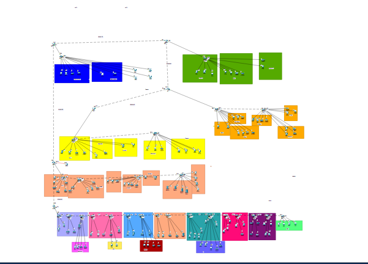

# Campus Enterprise Network Design (Cisco Packet Tracer)

## 📌 Overview
Designed and implemented a scalable multi-campus network for SZABIST Karachi connecting six campuses using a hierarchical architecture.

## 🏗️ Architecture
- Core–Distribution–Access model
- Edge Router (99 Campus) connecting all buildings
- VLAN-based segmentation for departments

## ⚙️ Key Technologies
- VLANs for segmentation
- VLSM for efficient IP allocation
- OSPF for dynamic routing
- DHCP for automatic IP assignment
- Static IPs for servers and printers
- ACLs for network security

## 📊 Network Scale
- 6 interconnected campuses
- Multiple departments per campus
- Hundreds of devices (PCs, printers, servers)

## 🚀 Key Achievements
- Reduced IP wastage using VLSM
- Improved network organization using VLANs
- Built scalable enterprise-level architecture

## 📷 Network Topology

## 🛠️ Tools Used
- Cisco Packet Tracer

## 🔮 Future Improvements
- Add redundancy (HSRP, STP)
- Implement monitoring tools
- Enhance security (firewalls, IDS)
